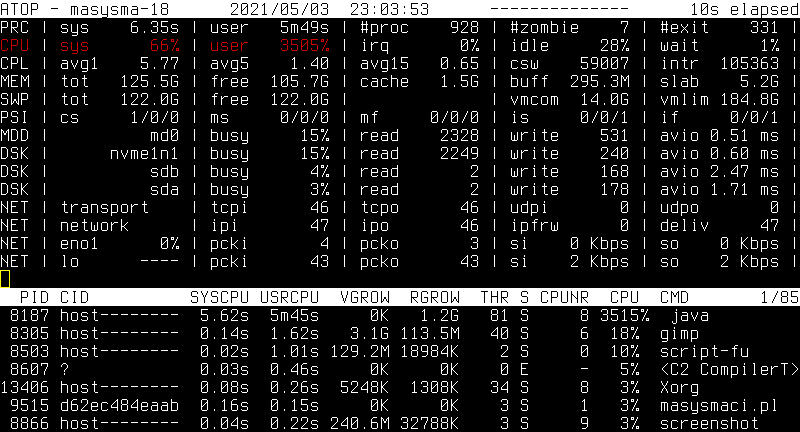
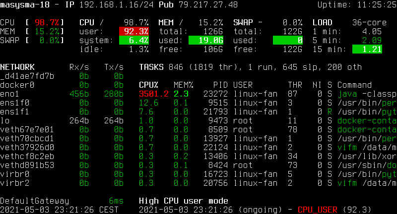
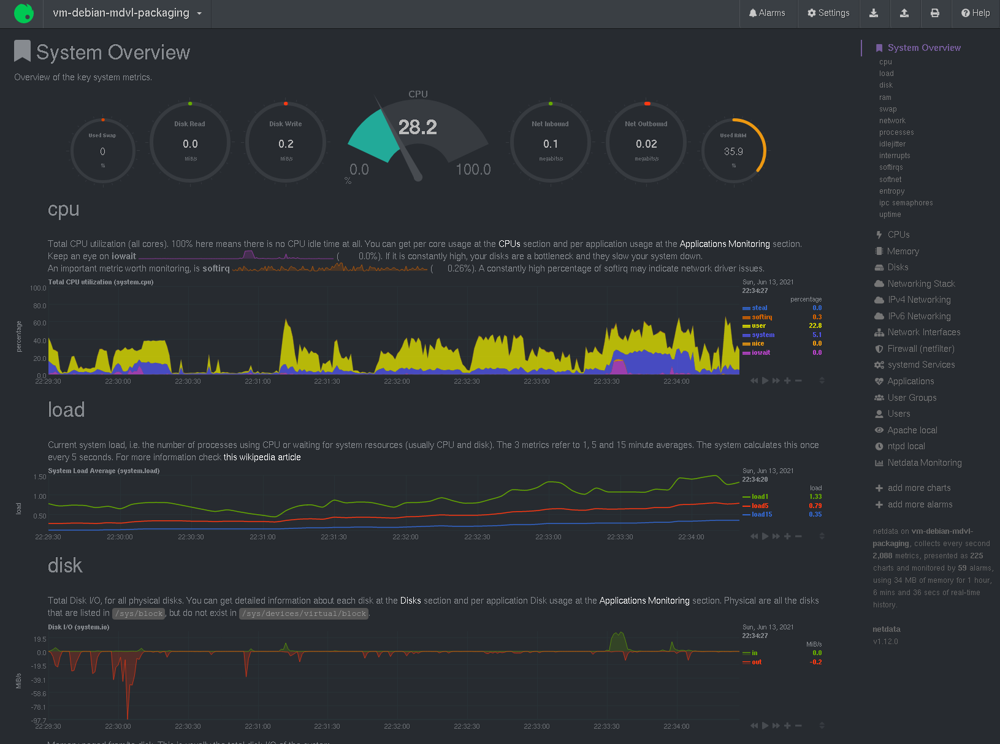
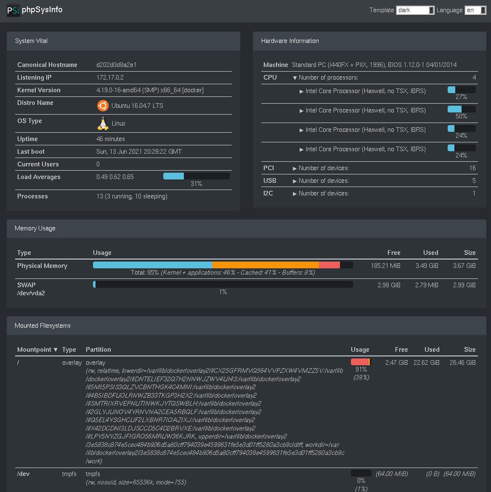
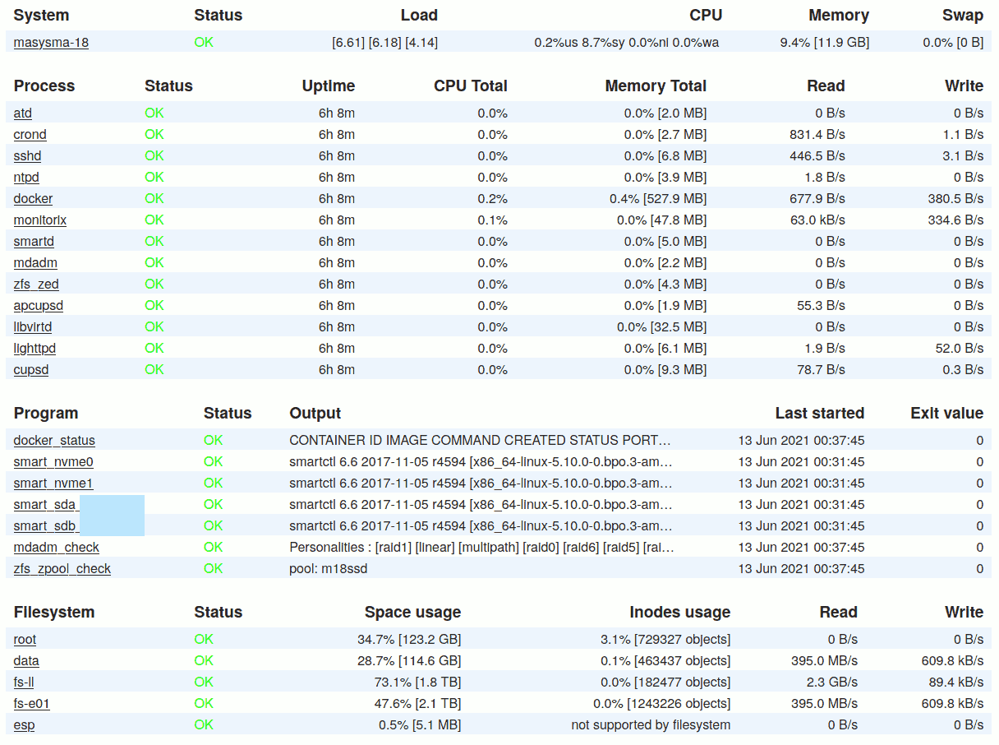
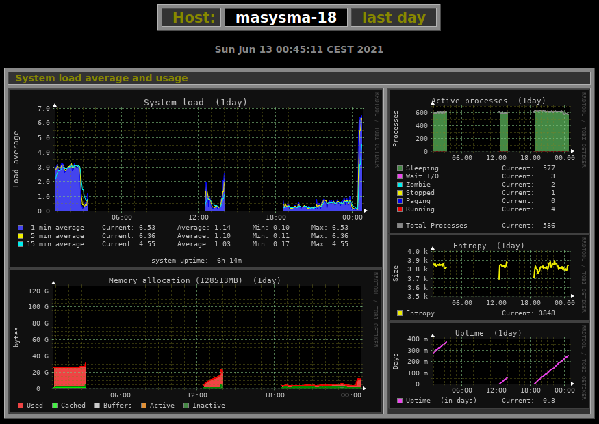

Background
==========

Previously, an advanced monitoring scheme using Grafana, Influxdb and Telegraf
was used at the Ma_Sys.ma:
[dashboards_with_docker(37)](dashboards_with_docker.xhtml). As of 04/2021, this
ceased to work due to errors in the Influxdb database: It would fail to start
and reject all attempts to send data with _401 Unauthorized_ errors.

The issue might have been caused by submitting a lot of metrics while creating
the backup tool comparison
[backup_tests_borg_bupstash_kopia(37)](backup_tests_borg_bupstash_kopia.xhtml),
but the actual reasons can only be speculated about.

The advanced monitoring scheme had been under testing for some time, but was
still lacking some checks like MDADM array health. Given the failure of the
Influxdb, three ideas came to mind:

 * Try to reset the Influxdb and re-start the advanced monitoring using an
   empty database. It seemed that chosing this option would sooner or later
   cause problems again given that the cause for the database failure had not
   been identified.
 * Switch from Influxdb+Telegraf to Prometheus+Node Exporter. This is a very
   viable choice but was not pursued due to the high amount of work needed to
   reconfigure all machines (TLS woes again!) and the re-create all Dashboards
   for the different data supplied by Node Exporter. It still seems like a good
   exercise to do this some day, but for now it seemed too much.
 * Use less complicated (smaller, fewer) software. There are many tools
   dedicated to monitoring and they often solve a lot of the problems associated
   with the “selfmade” solutions out of the box. Especially, following this way,
   it seemed possible to fix some of the old issues regarding the existent
   monitoring that turned out to be difficult in the past.

Hence, the search for an alternative monitoring program began.

A Variety of less complicated Monitoring Programs for Linux
===========================================================

This section collects all the canditates considered for monitoring that were
_not_ used for the purpose in the end. It serves as a reference should there
be need to reconstruct the monitoring again :)

## Atop

Links: <https://atoptool.nl/>,
[Debian-Package atop](https://packages.debian.org/buster/atop)

Atop is one of my favourite live monitoring tools for console usage on Linux.
Atop displays the activity on a system in a seemingly intimidating text-based
fashion squeezing as much information on the screen as possible.

Here are the reaons for this being my favorite:

 * The first nice thing about it: Any metric that is the current “bottleneck” is
   displayed in cyan (medium load) or red (high load). Unlike other tools, whose
   graphs one needs to study to digest to what the actual issue is, atop marks
   it right away.
 * Atop comes with `atopsar`: Running `atop` as a daemon generates compact
   binary reports that can be viewed with `atopsar` to check past states of the
   system.

Atop collects most important performance metrics and provides a means to view
their history. There are still some reasons for why Atop is not the (only)
monitoring tool of choice for unattended systems:

 * Atop does not have a web interface. This needs more setup on the viewing
   side. I was tempted to create some sort of periodically extracted report
   that would just convert the ANSI escape sequences to HTML, but I did not
   do it this time :)
 * Processing Atop's historic data is difficult: One can interactively do it
   with `atopsar`, but it is not straight-forward to extract periodic reports.
   For viewing larger time frames, diagrams would be helpful.

Here are some references about how one might boost Atop for monitoring purposes:

 * <https://github.com/fnep/aplot>
 * <https://github.com/rchakode/atop-graphite-grafana-monitoring>
 * <https://pcp.readthedocs.io/en/latest/UAG/IntroductionToPcp.html>:
   PCP seems to include an atop variant that makes data accessible more easily.
   But: PCP itself seems to be as complicated as it gets...

To conclude: Although I know this tool, although I like it very much, I did not
set it up for monitoring this time as it has some rough edges for that use case.

## Glances

Links: <https://nicolargo.github.com/glances/>,
[Debian-Package glances](https://packages.debian.org/buster/glances)

Glances serves a similar purpose to Atop but is aimed at larger screen spaces.
It does not monitor I/O as good as atop, but adds information on sensor readings
and filesystem usages if enough screen space is available. Glances does not
(by itself) offer a means to store and retrieve historic data.

In addition to its console-based live monitoring, Glances can
send metrics to time-series databases, produce alerts and display its output on
a web interface. This makes it a candidate for use in unattended monitoring
scenarios, but the necessity of a time-series database for historic data would
again complicate things too much.

## Netdata

Links: <https://github.com/netdata/netdata>,
[Debian-Package netdata](https://packages.debian.org/buster/netdata)

Netdata graphs a huge number of metrics in a web interface (under port 19999).
Similar to glances, Netdata can send metrics to an external server. Similar to
Grafana, it allows displaying the metrics as graphs over time or gauges for
showing the current value.

Some notes about Netdata's features with links to the respective documentation:

 * The diagrams to show can be configured.
 * By default, metrics are persisted for two days, but the duration is
   configurable, see
   <https://learn.netdata.cloud/docs/store/change-metrics-storage>
 * An external backend database can be used to store metrics, see
   <https://learn.netdata.cloud/docs/agent/exporting>
 * Netdata can monitor S.M.A.R.T data, see
   <https://learn.netdata.cloud/docs/agent/collectors/python.d.plugin/smartd_log>
 * It it can generate alerts, see
   <https://learn.netdata.cloud/docs/agent/health/notifications>
 * By default, Netdata does not monitor disk usage, but it can be configured,
   see <https://learn.netdata.cloud/docs/agent/collectors/diskspace.plugin>
 * Netdata can monitor MDADM RAIDs, see (already merged!)
   <https://github.com/netdata/netdata/pull/1489>
 * Netdata can monitor ZFS pool status, see (new and already merged!)
   <https://github.com/netdata/netdata/pull/11071>

To summarize: Although it seems a little odd to present all of the system's
health status as time-value-plots, Netdata can monitor just about everything.
It is a viable alternative to the Monit+Monitorix combination explained further
below.

## phpSysInfo

Links: <https://github.com/phpsysinfo/phpsysinfo>,
[Debian Package phpsysinfo](https://packages.debian.org/bullseye/phpsysinfo)

phpSysInfo displays the system status in a tabular fashion. It focuses on the
machine's properties combined with memory and file system usage. While it
gathers some information on load, phpSysInfo does not provide any diagrams with
historical data. Instead, it focuses on displaying the current system health
state.

phpSysInfo could be used as an alternative to Monit for the Ma_Sys.ma monitoring
purposes. Given that it runs entirely in PHP, configuring phpSysInfo to have
access to the system metrics as well as running securely on the web server
seems to be a little more complicated than with the other tools.

## Other Options

The following is a list of tools that were considered, but not tested
extensively for one reason or another:

 * Cacti: see notes at the very end if you are interested in this,
   <https://www.cacti.net/index.php>, in Debian
 * Cockpit: <https://cockpit-project.org/>, in Debian
 * collectd: <https://collectd.org/index.shtml>, in Debian
 * MRTG: <https://oss.oetiker.ch/mrtg/doc/mrtg.en.html>, in Debian
 * nikkiii: <https://github.com/nikkiii/status>
 * Statping: <https://github.com/statping/statping>
 * Ward: <https://github.com/B-Software/Ward>

Combining Monit and Monitorix for a comprehensive and simple System Monitoring
==============================================================================

As no single tool seemed to fit all the needs, two good ones were combined:

 * Monit performs OK/FAILED status checks and presents them under
   <http://127.0.0.1:2812>.
 * Monitorix creates performance graphs and presents them under
   <http://127.0.0.1:2813/monitorix>

## Monit

Monit creates a _status_ page that quickly allows one to identify if anything
is wrong with the running system. If the system is working normally, all
items display a green “OK”.

It does not log historic information and does not visualize them graphically.
Monit does, however, allow for presenting the currrent status of textual
information which is used by a series of custom scripts descripted in the
following.

The complete configuration and scripts can be found in the repository. See
file `masysma-default`.

### System Resources

Monit checks that system resources are not constantly overloaded.
This is especially important for disk space, but also for CPU load on small
systems whose cooling might not be up to constant 100% CPU loads.

### Services

Monit ensures that important services are running. The choice of services was
hand-crafted to make sure only the maningful ones are included. It mostly only
checks that the services are running and that some of their important files
exist with correct permissions. The associated monitoring instructions have
been derived from the examples supplied by Debian.

### RAID

Monit runs a custom script to check the RAID status. It is “dead simple” and
needs only two lines of code:

~~~
#!/bin/she -eu
# see statusscripts/mdadm.sh
cat /proc/mdstat
! grep -qF _ /proc/mdstat
~~~

Here, `cat` ensures the web interface will show the whole `/proc/mdstat` and
`grep -qF _` finds any failed drives listed in `/proc/mdstat`.

### ZFS

Similar to RAID, ZFS' status is also monitored by a custom script:

~~~
#!/bin/sh -eu
# see statusscripts/zpool.sh
zpoolstatus="$(LANG=en_US.UTF-8 zpool status)"
printf '%s\n' "$zpoolstatus"
printf '%s\n' "$zpoolstatus" | { ! grep -qE "(DEGRADED|UNAVAIL)"; }
~~~

Here, the first `printf` is to make the data visible in the web interface.
The second one scans for any signs of failed drives.

### Docker

A custom script for docker checks that there are no “unhealthy” services and
adds the output of `docker ps` to the web interface.

~~~
#!/bin/sh -eu
# see statusscripts/docker.sh
dockerinfo="$(LANG=en_US.UTF-8 docker ps)"
printf '%s\n' "$dockerinfo"
printf '%s\n' "$dockerinfo" | { ! grep -qF "unhealthy"; }
~~~

### S.M.A.R.T.

A more complicated script monitors the drive health as reported by the hardware.
Its basic form is as follows:

~~~
#!/bin/sh -eu
# see statusscripts/smartctl.sh
smartoutput="$(LANG=en_US.UTF-8 smartctl -H -A "$@")"
printf '%s\n' "$smartoutput"
printf '%s\n' "$smartoutput" | grep -qF ": PASSED"
~~~

Again, its the same pattern where the output is printed and the return code
indicates the success of the scripts execution. However, if you look a the
actual implementation in `statusscripts/smartctl.sh` you may notice there is
a quirk to save the output of `smartctl` to a file. This is intended to be used
in conjunction with MDVL package `mdvl-infobg` to display the S.M.A.R.T.
attribute names.

### Notifications

On non-interactive systems, Monit should be configured to send e-mail reports in
case of detected failures. This can be enabled by providing a file
like e.g. `masysma-16-email` under `/etc/monit/conf.d`:

	set mailserver smtp.example.com port 587
		username "machine@example.com" password "123456"
		using tlsv13
		with timeout 30 seconds

	set mail-format {
		from: machine@example.com
	}

	set alert admin@exmaple.com

This settings configure the sender to be `machine@example.com` (whose mail
password is `123456`) and the receiver to be `admin@example.com`.

## Monitorix

Monitorix is responsible for creating graphs and showing historic data. It
does not display any text information, but provides a large number of graphs
for different time intervals: day, week, month and year.

The Ma_Sys.ma configuration can be found as `70-masysma-default.conf` in the
repsitory. It keeps a lot of graphs disabled by default to make sure that all
of the graphs provided by default are meaningful. If more graphs are needed,
they can be enabled by providing another file like e.g. `80-masysma-18.conf`
under `/etc/monitorix/conf.d`. The values from the second file will then
override the defaults from `70-masysma-default.conf`.

A very nice property of Monitorix' approach to the graphis is their simplicity:

 * Data is stored in a fixed-size structur. Hence, it is impossible for the
   measurement values to eat up disk space or degrade processing performance
   from their growth.
 * Graphis are created as image files on a static HTML page.
   This page contains helpful comments for post-processing it. Should you
   e.g. want to display graphs in public, that should be as easy as copying
   the relevant graphs you want to show to a public location. Similarly,
   tools like `mdvl-infobg` can query the graphs and process them, too.

## Conclusion

So far, the new monitoring scheme has flawlessly been active for a month.
The only issue that monit reported was a high load on a non-interactively used
system during the transfer of a large backup.

Both tools: Monit and Monitorix seem to be capable of running un-attendedly for
long periods of time and that is their important advantage over more powerful
and more complex systems. Also, while it required a lot of tweaking and some
auxiliary scripts, the configuration is easily versioned as small text file
(snippets) in repositories.

## Future Directions

It would be really nice if a check for the system's patch level could be
inlcuded in Monit, i.e.: Are the most recent security updates installed?

Neither Monit nor Monitorix incorporate information from the various system
logs. `logwatch` is used for this on non-interactive systems, but it might be
interesting to explore, if some of the important functions of `logwatch` could
be integrated by means of custom Monit scripts?

Short note on getting to run Cacti
==================================

For Ma_Sys.ma monitoring purposes, Cacti was found to be too complex. Its
installation procedure was tried and it roughtly consists of the following steps
and components.

### MySQL

	CREATE DATABASE <database>;
	USE <database>;
	CREATE USER <user> IDENITFIED BY <password>;
	GRANT ALL PRIVILEGES ON *.* TO <user>;
	GRANT SELECT ON mysql.time_zone_name TO <user>;
	mysql -u root -p cacti < /usr/share/doc/cacti/cacti.sql
	mysql_tzinfo_to_sql /usr/share/zoneinfo/ | mysql -u root mysql

### PHP

	provide DB connection in config.php
	/etc/php/7.3/cgi/php.ini date.timezone=Europe/Berlin
	/etc/php/7.3/cli/php.ini date.timezone=Europe/Berlin

### GUI

	admin/admin -> admin/_0FAIL0_
	Theme: Sunrise

### OS

	# Temporary, revert after installation?
	chown www-data:www-data -R /usr/share/cacti
